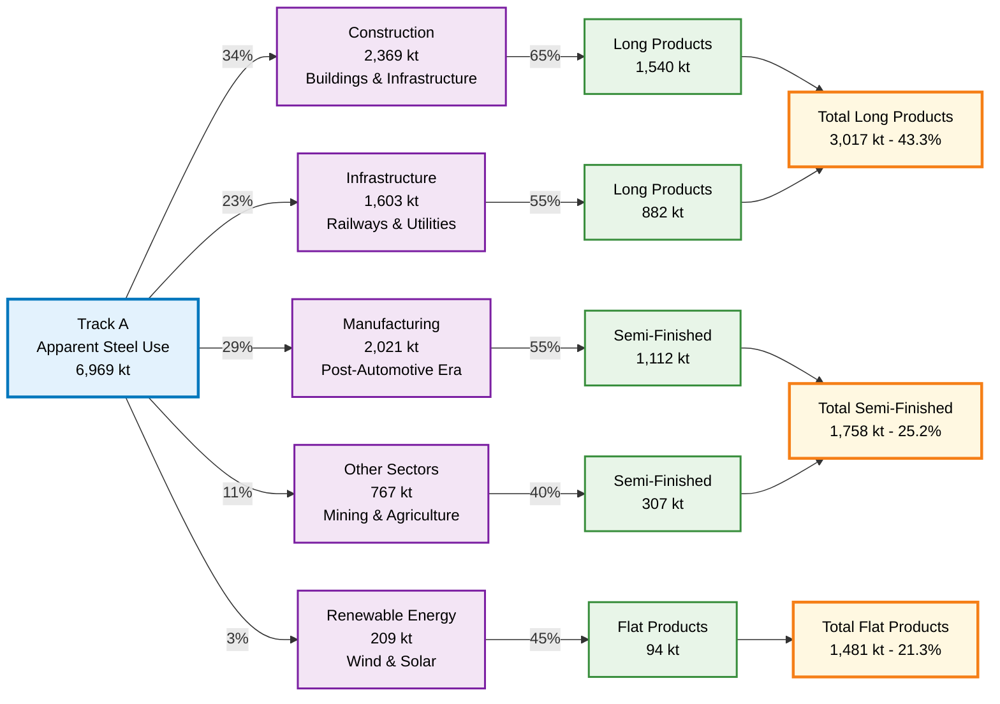
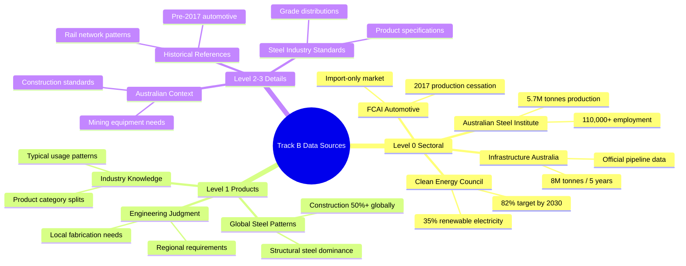

# Track B Hierarchical Steel Demand Structure - Mermaid Diagram

## Complete 4-Level Hierarchy Visualization

```mermaid
flowchart TD
    %% Level 0 - National Total
    L0[Level 0: National Steel Demand<br/>Track A Apparent Steel Use<br/>~6,969 kt/year 2025]
    
    %% Level 0 Sectoral Breakdown
    L0 --> CON[Construction Sector<br/>34% - 2,369 kt<br/>GDP-linked]
    L0 --> INF[Infrastructure Sector<br/>23% - 1,603 kt<br/>Population-linked]
    L0 --> MAN[Manufacturing Sector<br/>29% - 2,021 kt<br/>IP Index-linked]
    L0 --> REN[Renewable Energy Sector<br/>3% - 209 kt<br/>Capacity-linked]
    L0 --> OTH[Other Sectors<br/>11% - 767 kt<br/>Mining/Agriculture/Transport]
    
    %% Level 1 - Product Categories
    CON --> CON_LONG[Finished Long<br/>65% - 1,540 kt]
    CON --> CON_FLAT[Finished Flat<br/>20% - 474 kt]
    CON --> CON_SEMI[Semi-Finished<br/>8% - 190 kt]
    CON --> CON_TUBE[Tube/Pipe<br/>7% - 166 kt]
    
    INF --> INF_LONG[Finished Long<br/>55% - 882 kt]
    INF --> INF_TUBE[Tube/Pipe<br/>25% - 401 kt]
    INF --> INF_FLAT[Finished Flat<br/>12% - 192 kt]
    INF --> INF_SEMI[Semi-Finished<br/>8% - 128 kt]
    
    MAN --> MAN_SEMI[Semi-Finished<br/>55% - 1,112 kt]
    MAN --> MAN_FLAT[Finished Flat<br/>30% - 606 kt]
    MAN --> MAN_LONG[Finished Long<br/>12% - 243 kt]
    MAN --> MAN_TUBE[Tube/Pipe<br/>3% - 61 kt]
    
    REN --> REN_FLAT[Finished Flat<br/>45% - 94 kt]
    REN --> REN_LONG[Finished Long<br/>40% - 84 kt]
    REN --> REN_SEMI[Semi-Finished<br/>10% - 21 kt]
    REN --> REN_TUBE[Tube/Pipe<br/>5% - 10 kt]
    
    OTH --> OTH_SEMI[Semi-Finished<br/>40% - 307 kt]
    OTH --> OTH_LONG[Finished Long<br/>35% - 268 kt]
    OTH --> OTH_FLAT[Finished Flat<br/>15% - 115 kt]
    OTH --> OTH_TUBE[Tube/Pipe<br/>10% - 77 kt]
    
    %% Level 1 Totals (for reference)
    L1_SEMI[Level 1 Total<br/>Semi-Finished: 1,758 kt]
    L1_LONG[Level 1 Total<br/>Finished Long: 3,017 kt]
    L1_FLAT[Level 1 Total<br/>Finished Flat: 1,481 kt]
    L1_TUBE[Level 1 Total<br/>Tube/Pipe: 715 kt]
    
    %% Level 2 - Detailed Products (Semi-Finished Branch)
    CON_SEMI --> BILLETS_COMM[Commercial Billets<br/>55% - 966 kt]
    MAN_SEMI --> BILLETS_SBQ[SBQ Billets<br/>25% - 440 kt]
    INF_SEMI --> SLABS_STD[Standard Slabs<br/>15% - 264 kt]
    REN_SEMI --> BILLETS_DEG[Degassed Billets<br/>3% - 53 kt]
    OTH_SEMI --> SLABS_DEG[Degassed Slabs<br/>2% - 35 kt]
    
    %% Level 2 - Detailed Products (Long Products Branch)
    CON_LONG --> STRUCT_BEAMS[Structural Beams<br/>25% - 754 kt]
    INF_LONG --> REBAR[Reinforcing Bar<br/>25% - 754 kt]
    MAN_LONG --> STRUCT_COLS[Structural Columns<br/>15% - 453 kt]
    REN_LONG --> STRUCT_CHAN[Structural Channels<br/>12% - 362 kt]
    OTH_LONG --> RAILS_STD[Standard Rails<br/>6% - 181 kt]
    STRUCT_BEAMS --> OTHER_LONG[Other Long Products<br/>17% - 513 kt]
    
    %% Level 2 - Detailed Products (Flat Products Branch)
    CON_FLAT --> HOT_COIL[Hot Rolled Coil<br/>40% - 592 kt]
    MAN_FLAT --> COLD_COIL[Cold Rolled Coil<br/>25% - 370 kt]
    INF_FLAT --> PLATE[Steel Plate<br/>20% - 296 kt]
    REN_FLAT --> GALV[Galvanized Products<br/>15% - 222 kt]
    
    %% Level 2 - Detailed Products (Tube/Pipe Branch)
    CON_TUBE --> WELD_STRUCT[Welded Structural<br/>30% - 215 kt]
    INF_TUBE --> SEAMLESS_PIPE[Seamless Line Pipe<br/>25% - 179 kt]
    MAN_TUBE --> WELD_PIPE[Welded Line Pipe<br/>20% - 143 kt]
    OTH_TUBE --> OTHER_TUBE[Other Tube/Pipe<br/>25% - 179 kt]
    
    %% Level 3 - Client Product Specifications (Key Examples)
    BILLETS_COMM --> BILLET_LOW[Low Carbon Billets<br/>60% - 580 kt<br/>Construction Grade]
    BILLETS_COMM --> BILLET_MED[Medium Carbon Billets<br/>40% - 386 kt<br/>Manufacturing Grade]
    
    BILLETS_SBQ --> SBQ_AUTO[Automotive SBQ<br/>45% - 198 kt<br/>Historical Reference]
    BILLETS_SBQ --> SBQ_MINING[Mining Equipment SBQ<br/>35% - 154 kt<br/>Heavy Machinery]
    BILLETS_SBQ --> SBQ_OIL[Oil/Gas Equipment SBQ<br/>20% - 88 kt<br/>Energy Infrastructure]
    
    STRUCT_BEAMS --> UB_300[Universal Beams Grade 300<br/>80% - 603 kt<br/>Standard Construction]
    STRUCT_BEAMS --> UB_300P[Universal Beams Grade 300PLUS<br/>20% - 151 kt<br/>Infrastructure]
    
    STRUCT_COLS --> UC_300[Universal Columns Grade 300<br/>85% - 385 kt<br/>Building Construction]
    STRUCT_COLS --> UC_300P[Universal Columns Grade 300PLUS<br/>15% - 68 kt<br/>Infrastructure]
    
    RAILS_STD --> RAIL_FREIGHT[Standard Freight Rails<br/>70% - 127 kt<br/>100 tonnes/km]
    RAILS_STD --> RAIL_PASS[Standard Passenger Rails<br/>30% - 54 kt<br/>Urban Transit]
    
    %% Styling
    classDef level0 fill:#e1f5fe,stroke:#01579b,stroke-width:3px,color:#000
    classDef sector fill:#f3e5f5,stroke:#4a148c,stroke-width:2px,color:#000
    classDef level1 fill:#e8f5e8,stroke:#1b5e20,stroke-width:2px,color:#000
    classDef level2 fill:#fff3e0,stroke:#e65100,stroke-width:2px,color:#000
    classDef level3 fill:#fce4ec,stroke:#880e4f,stroke-width:2px,color:#000
    classDef total fill:#f1f8e9,stroke:#33691e,stroke-width:2px,color:#000
    
    class L0 level0
    class CON,INF,MAN,REN,OTH sector
    class CON_LONG,CON_FLAT,CON_SEMI,CON_TUBE,INF_LONG,INF_FLAT,INF_SEMI,INF_TUBE,MAN_SEMI,MAN_FLAT,MAN_LONG,MAN_TUBE,REN_FLAT,REN_LONG,REN_SEMI,REN_TUBE,OTH_SEMI,OTH_LONG,OTH_FLAT,OTH_TUBE level1
    class BILLETS_COMM,BILLETS_SBQ,SLABS_STD,BILLETS_DEG,SLABS_DEG,STRUCT_BEAMS,REBAR,STRUCT_COLS,STRUCT_CHAN,RAILS_STD,OTHER_LONG,HOT_COIL,COLD_COIL,PLATE,GALV,WELD_STRUCT,SEAMLESS_PIPE,WELD_PIPE,OTHER_TUBE level2
    class BILLET_LOW,BILLET_MED,SBQ_AUTO,SBQ_MINING,SBQ_OIL,UB_300,UB_300P,UC_300,UC_300P,RAIL_FREIGHT,RAIL_PASS level3
    class L1_SEMI,L1_LONG,L1_FLAT,L1_TUBE total
```

## Sector Flow Summary

## Research Confidence Levels by Hierarchy Level

```mermaid
flowchart TD
    %% Confidence Level Breakdown
    L0_CONF[Level 0 Sectoral Weights<br/>Mixed Confidence]
    L1_CONF[Level 1 Product Categories<br/>Medium Confidence]
    L2_CONF[Level 2 Detailed Products<br/>Medium-Low Confidence]
    L3_CONF[Level 3 Specifications<br/>Low-Medium Confidence]
    
    L0_CONF --> HIGH1[Infrastructure: 23%<br/>HIGH - Official Gov Data]
    L0_CONF --> HIGH2[Renewable: 3%<br/>HIGH - Steel Intensity Research]
    L0_CONF --> MED1[Construction: 34%<br/>MEDIUM - IA Data + Estimates]
    L0_CONF --> MED2[Manufacturing: 29%<br/>MEDIUM - Post-Auto Analysis]
    L0_CONF --> LOW1[Other Sectors: 11%<br/>LOW - Mathematical Residual]
    
    L1_CONF --> MED_L1[Most L0→L1 Mappings<br/>MEDIUM - Industry Knowledge]
    L1_CONF --> HIGH_L1[Renewable Mappings<br/>HIGH - Empirical Research]
    L1_CONF --> LOW_L1[Other Sector Mappings<br/>LOW - Estimated]
    
    L2_CONF --> EST_L2[Most L1→L2 Splits<br/>ESTIMATED - Industry Patterns]
    L2_CONF --> MIX_L2[Some Specific Products<br/>MIXED - Context + Estimates]
    
    L3_CONF --> CONTEXT_L3[Automotive References<br/>CONTEXTUAL - Pre-2017]
    L3_CONF --> EST_L3[Grade Distributions<br/>ESTIMATED - Standards]
    L3_CONF --> MED_L3[Mining/Construction<br/>MEDIUM - Industry Context]
    
    %% Styling
    classDef high fill:#c8e6c9,stroke:#2e7d32,stroke-width:2px,color:#000
    classDef medium fill:#fff3c4,stroke:#f57f17,stroke-width:2px,color:#000
    classDef low fill:#ffcdd2,stroke:#c62828,stroke-width:2px,color:#000
    classDef mixed fill:#e1bee7,stroke:#8e24aa,stroke-width:2px,color:#000
    
    class HIGH1,HIGH2,HIGH_L1 high
    class MED1,MED2,MED_L1,MED_L3 medium
    class LOW1,LOW_L1,EST_L2,EST_L3 low
    class MIX_L2,CONTEXT_L3 mixed
```

## Key Data Sources by Level

---

*Diagrams Generated: July 10, 2025*  
*Australian Steel Demand Model (SDM) - Track B Hierarchy Visualization*  
*Total Factors Documented: 68 across 4 hierarchical levels*