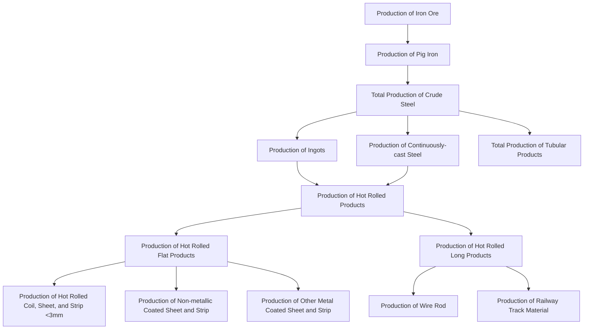
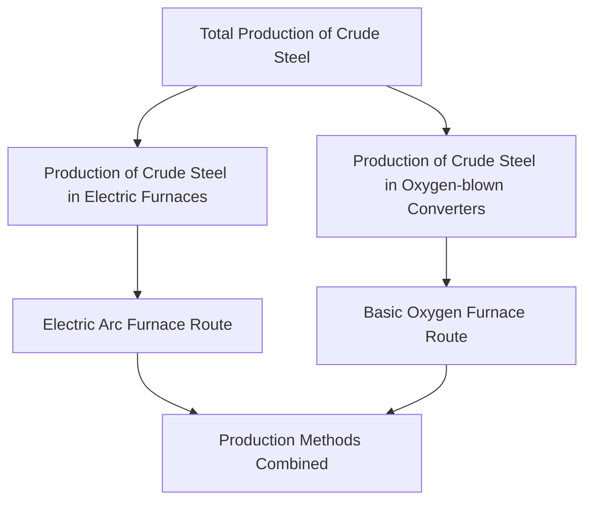
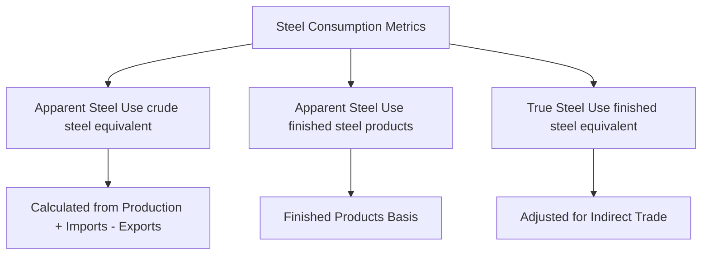
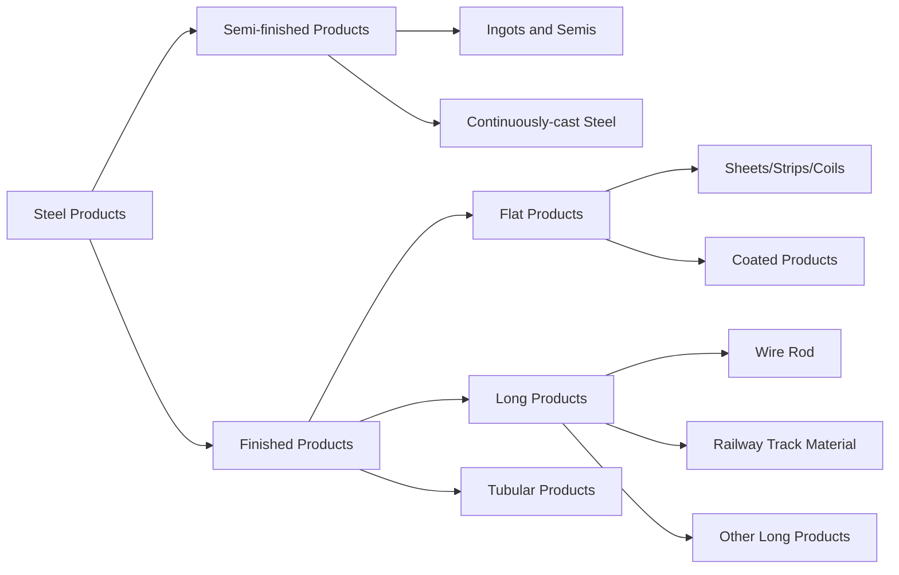

# World Steel Association Statistics Hierarchy Diagrams

## 1. Production Flow Hierarchy
This diagram shows the transformation from raw materials to finished steel products:

## 2. Crude Steel Production Methods
This diagram shows the different production pathways for crude steel:

## 3. Trade Flow Hierarchy
This diagram illustrates the import/export structure for steel products:

```mermaid
graph TD
    A[Trade in Steel Products]
    
    A --> B[Exports]
    A --> C[Imports]
    
    B --> D[Exports of Iron Ore]
    B --> E[Exports of Pig Iron]
    B --> F[Exports of Scrap]
    B --> G[Exports of Ingots and Semis]
    B --> H[Exports of Flat Products]
    B --> I[Exports of Long Products]
    B --> J[Exports of Semi-finished and Finished Steel Products]
    B --> K[Exports of Tubular Products]
    
    C --> L[Imports of Iron Ore]
    C --> M[Imports of Pig Iron]
    C --> N[Imports of Scrap]
    C --> O[Imports of Direct Reduced Iron]
    C --> P[Imports of Ingots and Semis]
    C --> Q[Imports of Flat Products]
    C --> R[Imports of Long Products]
    C --> S[Imports of Semi-finished and Finished Steel Products]
    C --> T[Imports of Tubular Products]
```

## 4. Steel Use Metrics Hierarchy
This diagram shows the relationship between different steel consumption measures:

## 5. Product Categories Relationship
This diagram shows how different product categories relate to each other:

## Key Relationships Explained

### Raw Material to Product Flow:
- **Level 0**: Iron Ore (raw material)
- **Level 1**: Pig Iron (primary processing)
- **Level 2**: Crude Steel (intermediate product)
- **Level 3**: Semi-finished products (Ingots, Continuously-cast steel)
- **Level 4**: Hot Rolled Products (primary finished products)
- **Level 5**: Specialized finished products (Coated sheets, Wire rod, etc.)

### Production Process Branches:
1. **Primary Route**: Iron Ore → Pig Iron → Crude Steel (via oxygen converters)
2. **Secondary Route**: Scrap → Crude Steel (via electric furnaces)
3. **Direct Reduction**: Iron Ore → Direct Reduced Iron → Crude Steel

### Trade Balance Components:
- Each product category has corresponding export and import volumes
- Net trade position = Exports - Imports
- Apparent consumption = Production + Imports - Exports

### Product Categorization:
- **Flat Products**: Sheets, strips, plates, coils
- **Long Products**: Bars, rods, sections, rails
- **Tubular Products**: Pipes and tubes
- **Semi-finished**: Ingots, billets, slabs, blooms