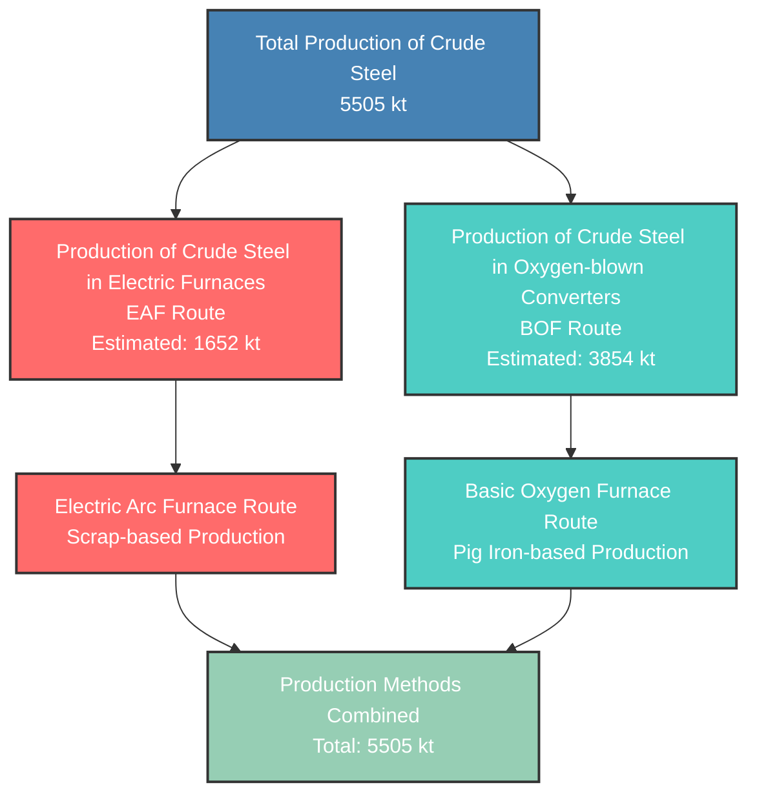

# WSA Crude Steel Production Methods - 2050

This diagram shows the different production pathways for crude steel based on WSA methodology.

## Crude Steel Production Methods - 2050

| Production Method | Estimated Volume (kt) | Share (%) |
|-------------------|----------------------|-----------|
| Electric Arc Furnace (EAF) | 1652 | 30% |
| Basic Oxygen Furnace (BOF) | 3854 | 70% |
| **Total Crude Steel** | **5505** | **100%** |

*Note: EAF/BOF split estimated using typical Australian steel industry proportions*
*Based on official WSA Crude Steel Production Methods diagram*

