# WSA Trade Flow Hierarchy - 2025

This diagram illustrates the import/export structure for steel products based on WSA methodology.

```mermaid
graph TD
    %% Define styles
    classDef trade fill:#9370DB,stroke:#333,stroke-width:2px,color:#fff
    classDef exports fill:#FF6B6B,stroke:#333,stroke-width:2px,color:#fff
    classDef imports fill:#4ECDC4,stroke:#333,stroke-width:2px,color:#fff
    classDef products fill:#FFB84D,stroke:#333,stroke-width:2px,color:#fff
    
    %% WSA Trade Flow Structure
    A[Trade in Steel Products<br/>Total Trade Volume]
    
    B[Exports<br/>Steel Products Exported]
    C[Imports<br/>Steel Products Imported]
    
    %% Export Categories
    D[Exports of Iron Ore]
    E[Exports of Pig Iron]
    F[Exports of Scrap]
    G[Exports of Ingots and Semis]
    H[Exports of Flat Products<br/>Est. 323 kt]
    I[Exports of Long Products<br/>Est. 177 kt]
    J[Exports of Semi-finished and Finished Steel Products]
    K[Exports of Tubular Products<br/>Est. 8 kt]
    
    %% Import Categories
    L[Imports of Iron Ore]
    M[Imports of Pig Iron]
    N[Imports of Scrap]
    O[Imports of Direct Reduced Iron]
    P[Imports of Ingots and Semis]
    Q[Imports of Flat Products]
    R[Imports of Long Products]
    S[Imports of Semi-finished and Finished Steel Products]
    T[Imports of Tubular Products]
    
    %% Trade Flow Connections
    A --> B
    A --> C
    
    B --> D
    B --> E
    B --> F
    B --> G
    B --> H
    B --> I
    B --> J
    B --> K
    
    C --> L
    C --> M
    C --> N
    C --> O
    C --> P
    C --> Q
    C --> R
    C --> S
    C --> T
    
    %% Apply Styles
    class A trade
    class B exports
    class C imports
    class D,E,F,G,H,I,J,K exports
    class L,M,N,O,P,Q,R,S,T imports
```

## Trade Flow Categories - 2025

| Trade Category | Product Type | Example Volume Estimate (kt) |
|----------------|--------------|-------------------------------|
| Flat Products | Sheets, Strips, Coils | 3232 |
| Long Products | Bars, Rods, Rails | 1772 |
| Tubular Products | Pipes, Tubes | 156 |

*Based on official WSA Trade Flow Hierarchy diagram*
*Trade volumes estimated from production data*

