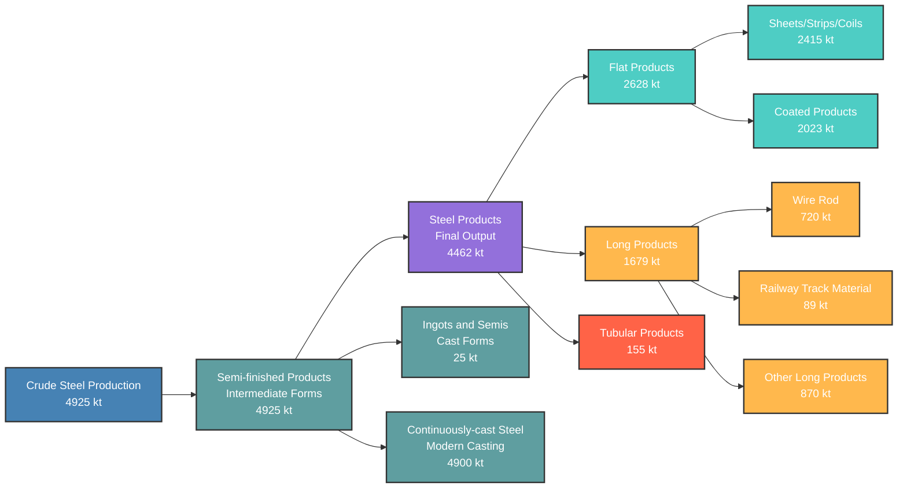

# WSA Product Categories Relationship - 2015

This diagram shows how different product categories relate to each other in the WSA framework.

## Product Categories Summary - 2015 (CORRECTED HIERARCHY)

| Production Stage | Category | Total Volume (kt) | Track A Coverage |
|-----------------|----------|-------------------|------------------|
| **Crude Steel** | Total Production | 4925 | ✅ Full |
| **Semi-finished** | Ingots + Continuously-cast | 4925 | ✅ Full |
| **Final Products** | Flat + Long + Tubular | 4462 | ✅ Full |

### Product Categories Breakdown:
| Category | Sub-categories | Total Volume (kt) | Track A Coverage |
|----------|----------------|-------------------|------------------|
| **Flat Products** | Sheets, Strips, Coils, Coated | 2628 | ✅ Full |
| **Long Products** | Wire Rod, Rails, Other Sections | 1679 | ✅ Full |
| **Tubular Products** | Pipes, Tubes | 155 | ✅ Full |

### Production Flow Logic:
- **Crude Steel** (4925 kt) → **Semi-finished** (4925 kt) → **Final Products** (4462 kt)
- **Yield Loss**: 9.4% processing loss from semi-finished to final products

### Product Specialization:
- **Hot Rolled Coil, Sheet, Strip (<3mm)**: 2415 kt
- **Non-metallic Coated Products**: 656 kt  
- **Metal Coated Products**: 1367 kt

*Based on official WSA Product Categories Relationship diagram*

