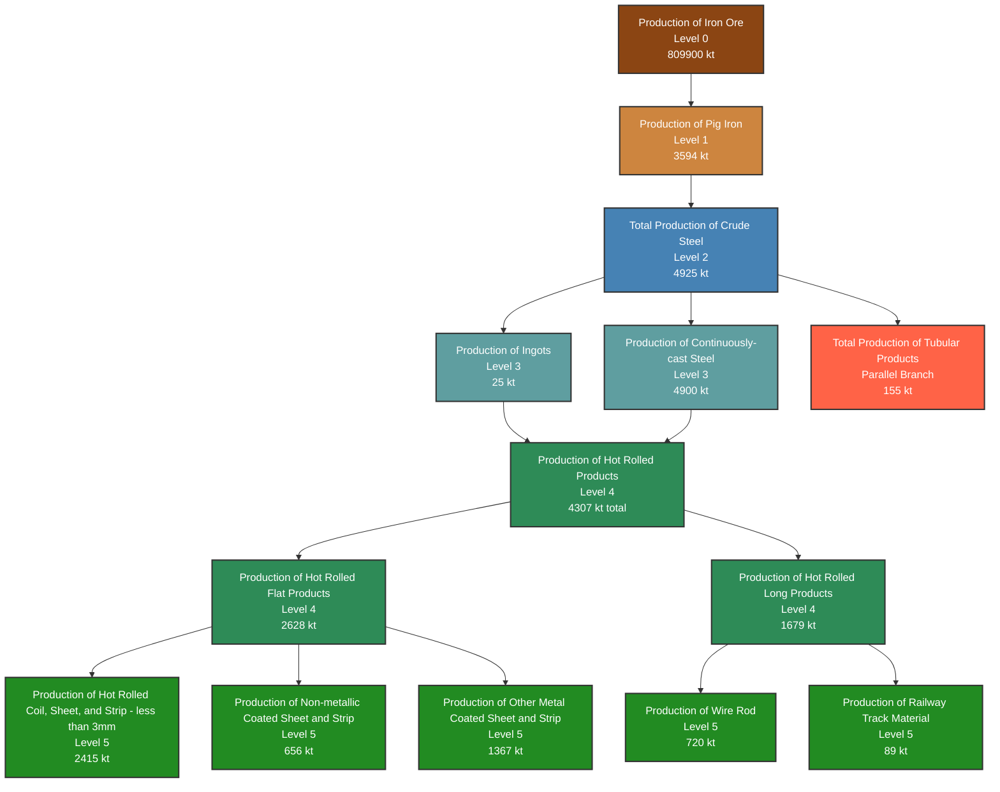

# WSA Production Flow Hierarchy - 2015

This diagram replicates the official WSA Production Flow Hierarchy with 2015 forecast volumes.

## Production Flow Summary - 2015

| Category | Volume (kt) | Share (%) |
|----------|-------------|-----------|\n| Production of Iron Ore | 809900 | 94.4% |\n| True Steel Use (finished steel equivalent) | 11228 | 1.3% |\n| Apparent Steel Use (crude steel equivalent) | 6967 | 0.8% |\n| Apparent Steel Use (finished steel products) | 6291 | 0.7% |\n| Total Production of Crude Steel | 4925 | 0.6% |\n| Production of Continuously-cast Steel | 4900 | 0.6% |\n| Production of Pig Iron | 3594 | 0.4% |\n| Production of Hot Rolled Flat Products | 2628 | 0.3% |\n| Production of Hot Rolled Coil, Sheet, and Strip (<3mm) | 2415 | 0.3% |\n| Production of Hot Rolled Long Products | 1679 | 0.2% |\n| Production of Other Metal Coated Sheet and Strip | 1367 | 0.2% |\n| Production of Wire Rod | 720 | 0.1% |\n| Production of Non-metallic Coated Sheet and Strip | 656 | 0.1% |\n| Total Production of Tubular Products | 155 | 0.0% |\n| Production of Railway Track Material | 89 | 0.0% |\n| Production of Ingots | 25 | 0.0% |\n| **Total** | **857539** | **100.0%** |

*Based on official WSA Production Flow Hierarchy diagram*
*Volumes represent Track A forecasts mapped to WSA categories*

