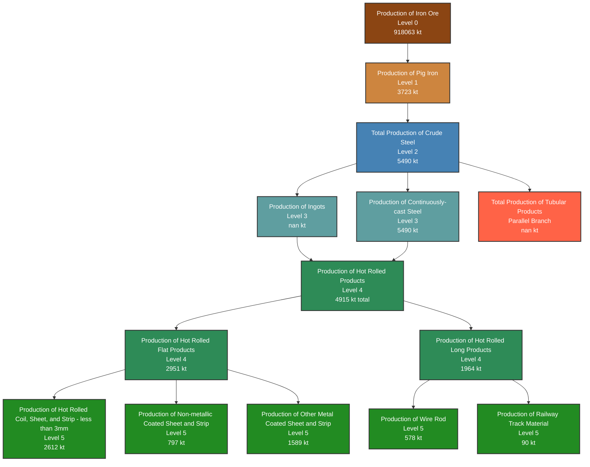

# WSA Production Flow Hierarchy - 2020

This diagram replicates the official WSA Production Flow Hierarchy with 2020 forecast volumes.

## Production Flow Summary - 2020

| Category | Volume (kt) | Share (%) |
|----------|-------------|-----------|\n| Apparent Steel Use (crude steel equivalent) | 5648 | 0.0% |\n| Production of Continuously-cast Steel | 5490 | 0.0% |\n| Production of Ingots | nan | 0.0% |\n| Production of Iron Ore | 918063 | 0.0% |\n| Total Production of Crude Steel | 5490 | 0.0% |\n| Apparent Steel Use (finished steel products) | 5100 | 0.0% |\n| Production of Pig Iron | 3723 | 0.0% |\n| Production of Hot Rolled Flat Products | 2951 | 0.0% |\n| Production of Hot Rolled Coil, Sheet, and Strip (<3mm) | 2612 | 0.0% |\n| Production of Hot Rolled Long Products | 1964 | 0.0% |\n| Production of Other Metal Coated Sheet and Strip | 1589 | 0.0% |\n| Production of Non-metallic Coated Sheet and Strip | 797 | 0.0% |\n| Production of Wire Rod | 578 | 0.0% |\n| Production of Railway Track Material | 90 | 0.0% |\n| Total Production of Tubular Products | nan | 0.0% |\n| True Steel Use (finished steel equivalent) | nan | 0.0% |\n| **Total** | **nan** | **100.0%** |

*Based on official WSA Production Flow Hierarchy diagram*
*Volumes represent Track A forecasts mapped to WSA categories*

