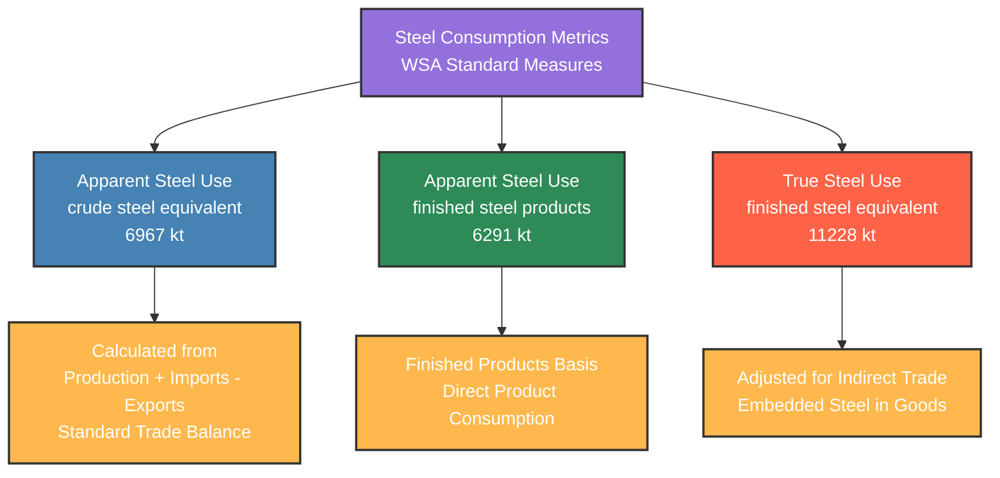

# WSA Steel Use Metrics Hierarchy - 2015

This diagram shows the relationship between different steel consumption measures as defined by WSA.

## Steel Use Metrics Comparison - 2015

| WSA Consumption Metric | Volume (kt) | Calculation Method | Purpose |
|------------------------|-------------|-------------------|---------|
| **Apparent Steel Use (crude steel equivalent)** | 6967 | Production + Imports - Exports | Standard trade balance |
| **Apparent Steel Use (finished steel products)** | 6291 | Finished products basis | Direct consumption |
| **True Steel Use (finished steel equivalent)** | 11228 | Adjusted for indirect trade | Comprehensive consumption |

### Key Differences:
- **Crude Steel Equivalent**: Raw steel production accounting
- **Finished Steel Products**: End-product consumption focus  
- **Finished Steel Equivalent**: Most comprehensive measure including indirect trade

*Based on official WSA Steel Use Metrics Hierarchy diagram*

