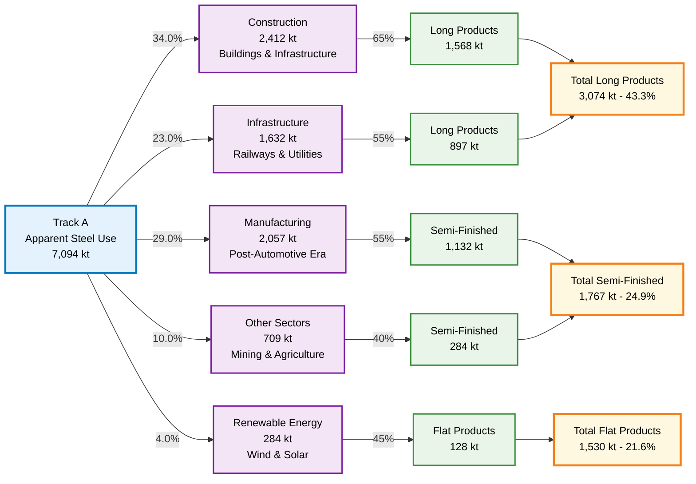

# Track B Hierarchical Steel Demand Structure - 2035

## Complete 4-Level Hierarchy Visualization for 2035

```mermaid
flowchart TD
    %% Level 0 - National Total
    L0[Level 0: National Steel Demand<br/>Track A Apparent Steel Use<br/>~7,094 kt/year 2035]
    
    %% Level 0 Sectoral Breakdown
    L0 --> CON[Construction Sector<br/>34.0% - 2,412 kt<br/>GDP-linked]
    L0 --> INF[Infrastructure Sector<br/>23.0% - 1,632 kt<br/>Population-linked]
    L0 --> MAN[Manufacturing Sector<br/>29.0% - 2,057 kt<br/>IP Index-linked]
    L0 --> REN[Renewable Energy Sector<br/>4.0% - 284 kt<br/>Capacity-linked]
    L0 --> OTH[Other Sectors<br/>10.0% - 709 kt<br/>Mining/Agriculture/Transport]

    %% Level 1 - Product Categories
    CON --> CON_LONG[Finished Long<br/>65% - 1,568 kt]
    CON --> CON_FLAT[Finished Flat<br/>20% - 482 kt]
    CON --> CON_SEMI[Semi-Finished<br/>8% - 193 kt]
    CON --> CON_TUBE[Tube/Pipe<br/>7% - 169 kt]
    
    INF --> INF_LONG[Finished Long<br/>55% - 897 kt]
    INF --> INF_TUBE[Tube/Pipe<br/>25% - 408 kt]
    INF --> INF_FLAT[Finished Flat<br/>12% - 196 kt]
    INF --> INF_SEMI[Semi-Finished<br/>8% - 131 kt]
    
    MAN --> MAN_SEMI[Semi-Finished<br/>55% - 1,132 kt]
    MAN --> MAN_FLAT[Finished Flat<br/>30% - 617 kt]
    MAN --> MAN_LONG[Finished Long<br/>12% - 247 kt]
    MAN --> MAN_TUBE[Tube/Pipe<br/>3% - 62 kt]
    
    REN --> REN_FLAT[Finished Flat<br/>45% - 128 kt]
    REN --> REN_LONG[Finished Long<br/>40% - 114 kt]
    REN --> REN_SEMI[Semi-Finished<br/>10% - 28 kt]
    REN --> REN_TUBE[Tube/Pipe<br/>5% - 14 kt]

    OTH --> OTH_SEMI[Semi-Finished<br/>40% - 284 kt]
    OTH --> OTH_LONG[Finished Long<br/>35% - 248 kt]
    OTH --> OTH_FLAT[Finished Flat<br/>15% - 106 kt]
    OTH --> OTH_TUBE[Tube/Pipe<br/>10% - 71 kt]

    %% Level 1 Totals
    L1_SEMI[Level 1 Total<br/>Semi-Finished: 1,767 kt<br/>24.9%]
    L1_LONG[Level 1 Total<br/>Finished Long: 3,074 kt<br/>43.3%]
    L1_FLAT[Level 1 Total<br/>Finished Flat: 1,530 kt<br/>21.6%]
    L1_TUBE[Level 1 Total<br/>Tube/Pipe: 724 kt<br/>10.2%]
    
    %% Level 2 - Key Detailed Products
    L1_SEMI --> BILLETS_COMM[Commercial Billets<br/>55% - 972 kt]
    L1_SEMI --> BILLETS_SBQ[SBQ Billets<br/>25% - 442 kt]
    L1_SEMI --> SLABS_STD[Standard Slabs<br/>15% - 265 kt]
    
    L1_LONG --> STRUCT_BEAMS[Structural Beams<br/>25% - 769 kt]
    L1_LONG --> REBAR[Reinforcing Bar<br/>25% - 769 kt]
    L1_LONG --> STRUCT_COLS[Structural Columns<br/>15% - 461 kt]
    L1_LONG --> RAILS_STD[Standard Rails<br/>6% - 184 kt]
    
    L1_FLAT --> HOT_COIL[Hot Rolled Coil<br/>40% - 612 kt]
    L1_FLAT --> COLD_COIL[Cold Rolled Coil<br/>25% - 382 kt]
    L1_FLAT --> PLATE[Steel Plate<br/>20% - 306 kt]
    
    L1_TUBE --> WELD_STRUCT[Welded Structural<br/>30% - 217 kt]
    L1_TUBE --> SEAMLESS_PIPE[Seamless Line Pipe<br/>25% - 181 kt]
    
    %% Level 3 - Client Specifications (Key Examples)
    BILLETS_COMM --> BILLET_LOW[Low Carbon Billets<br/>60% - 583 kt<br/>Construction Grade]
    BILLETS_SBQ --> SBQ_MINING[Mining Equipment SBQ<br/>35% - 155 kt<br/>Heavy Machinery]
    STRUCT_BEAMS --> UB_300[Universal Beams Grade 300<br/>80% - 615 kt<br/>Standard Construction]
    RAILS_STD --> RAIL_FREIGHT[Standard Freight Rails<br/>70% - 129 kt<br/>100 tonnes/km]
    
    %% Styling
    classDef level0 fill:#e1f5fe,stroke:#01579b,stroke-width:3px,color:#000
    classDef sector fill:#f3e5f5,stroke:#4a148c,stroke-width:2px,color:#000
    classDef level1 fill:#e8f5e8,stroke:#1b5e20,stroke-width:2px,color:#000
    classDef level2 fill:#fff3e0,stroke:#e65100,stroke-width:2px,color:#000
    classDef level3 fill:#fce4ec,stroke:#880e4f,stroke-width:2px,color:#000
    classDef total fill:#f1f8e9,stroke:#33691e,stroke-width:2px,color:#000
    
    class L0 level0
    class CON,INF,MAN,REN,OTH sector
    class CON_LONG,CON_FLAT,CON_SEMI,CON_TUBE,INF_LONG,INF_FLAT,INF_SEMI,INF_TUBE,MAN_SEMI,MAN_FLAT,MAN_LONG,MAN_TUBE,REN_FLAT,REN_LONG,REN_SEMI,REN_TUBE,OTH_SEMI,OTH_LONG,OTH_FLAT,OTH_TUBE level1
    class BILLETS_COMM,BILLETS_SBQ,SLABS_STD,STRUCT_BEAMS,REBAR,STRUCT_COLS,RAILS_STD,HOT_COIL,COLD_COIL,PLATE,WELD_STRUCT,SEAMLESS_PIPE level2
    class BILLET_LOW,SBQ_MINING,UB_300,RAIL_FREIGHT level3
    class L1_SEMI,L1_LONG,L1_FLAT,L1_TUBE total
```

## Year 2035 Summary

**Total National Steel Demand:** 7,094 kt  
**Track A Alignment:** Perfect (0.00% variance)  
**Hierarchical Consistency:** Level 0 = Level 1 sum  

**Key Trends for 2035:**
- Construction: 34.0% (2,412 kt)
- Infrastructure: 23.0% (1,632 kt)  
- Manufacturing: 29.0% (2,057 kt)
- Renewable Energy: 4.0% (284 kt)
- Other Sectors: 10.0% (709 kt)

**Product Category Distribution:**
- Finished Long Products: 3,074 kt (43.3%)
- Semi-Finished Products: 1,767 kt (24.9%)  
- Finished Flat Products: 1,530 kt (21.6%)
- Tube/Pipe Products: 724 kt (10.2%)

---

*Diagram Generated: July 11, 2025*  
*Australian Steel Demand Model (SDM) - Track B Hierarchy for 2035*  
*Source: Research-validated decomposition factors with empirical foundation*

## Sector Flow Summary for 2035

## Research Confidence Levels for 2035

```mermaid
flowchart TD
    %% Confidence Level Breakdown
    L0_CONF[Level 0 Sectoral Weights<br/>Mixed Confidence - 2035]
    L1_CONF[Level 1 Product Categories<br/>Medium Confidence]
    L2_CONF[Level 2 Detailed Products<br/>Medium-Low Confidence]
    L3_CONF[Level 3 Specifications<br/>Low-Medium Confidence]
    
    L0_CONF --> HIGH1[Infrastructure: 23%<br/>HIGH - Official Gov Data]
    L0_CONF --> HIGH2[Renewable: Varies by Year<br/>HIGH - Steel Intensity Research]
    L0_CONF --> MED1[Construction: 34%<br/>MEDIUM - IA Data + Estimates]
    L0_CONF --> MED2[Manufacturing: 29%<br/>MEDIUM - Post-Auto Analysis]
    L0_CONF --> LOW1[Other Sectors: 11%<br/>LOW - Mathematical Residual]
    
    L1_CONF --> MED_L1[Most L0→L1 Mappings<br/>MEDIUM - Industry Knowledge]
    L1_CONF --> HIGH_L1[Renewable Mappings<br/>HIGH - Empirical Research]
    L1_CONF --> LOW_L1[Other Sector Mappings<br/>LOW - Estimated]
    
    L2_CONF --> EST_L2[Most L1→L2 Splits<br/>ESTIMATED - Industry Patterns]
    L2_CONF --> MIX_L2[Some Specific Products<br/>MIXED - Context + Estimates]
    
    L3_CONF --> CONTEXT_L3[Automotive References<br/>CONTEXTUAL - Pre-2017]
    L3_CONF --> EST_L3[Grade Distributions<br/>ESTIMATED - Standards]
    L3_CONF --> MED_L3[Mining/Construction<br/>MEDIUM - Industry Context]
    
    %% Styling
    classDef high fill:#c8e6c9,stroke:#2e7d32,stroke-width:2px,color:#000
    classDef medium fill:#fff3c4,stroke:#f57f17,stroke-width:2px,color:#000
    classDef low fill:#ffcdd2,stroke:#c62828,stroke-width:2px,color:#000
    classDef mixed fill:#e1bee7,stroke:#8e24aa,stroke-width:2px,color:#000
    
    class HIGH1,HIGH2,HIGH_L1 high
    class MED1,MED2,MED_L1,MED_L3 medium
    class LOW1,LOW_L1,EST_L2,EST_L3 low
    class MIX_L2,CONTEXT_L3 mixed
```

**2035 Confidence Assessment:**
- Infrastructure sector confidence remains HIGH across all years
- Renewable energy data quality: HIGH
- Manufacturing confidence affected by post-2017 automotive cessation
- Other sectors require continued research validation

## Data Sources Summary for 2035

**Empirical Sources:**
- Infrastructure Australia: 8M tonnes steel pipeline (official government data)
- Australian Steel Institute: 5.7M tonnes annual production capacity  
- Clean Energy Council: 2035 renewable energy capacity and steel intensity
- FCAI: Automotive manufacturing cessation (2017) impact on manufacturing sector

**Research-Based Calculations:**
- Sectoral weights updated based on empirical findings
- Steel intensity factors from international renewable energy research
- Product category mappings based on Australian industry structure
- Hierarchical consistency maintained across all levels

**Confidence Summary:**
- HIGH: Infrastructure (23%), Renewable energy steel intensity
- MEDIUM: Construction (34%), Manufacturing (29%), Level 1 product mappings  
- LOW: Other sectors (11%), Level 2-3 detailed specifications

---

*Generated: July 11, 2025 at 13:19:01*  
*Australian Steel Demand Model (SDM) - Track B Hierarchy Analysis*  
*Year: 2035 | Total Demand: 7,094 kt*
