# Track B Steel Taxonomy Hierarchy - 2025

```mermaid
graph TD
    A["Total Steel Consumption<br/>6969 kt"] --> B1["SEMI_FINISHED<br/>1761 kt"]
    A --> B2["FINISHED_FLAT<br/>1463 kt"]
    A --> B3["FINISHED_LONG<br/>3026 kt"]
    A --> B4["TUBE_PIPE<br/>718 kt"]
    
    %% Semi-finished products
    B1 --> C1["BILLETS_COMMERCIAL<br/>969 kt"]
    B1 --> C2["BILLETS_SBQ<br/>440 kt"]
    B1 --> C3["SLABS_STANDARD<br/>264 kt"]
    B1 --> C4["BILLETS_DEGASSED<br/>53 kt"]
    B1 --> C5["SLABS_DEGASSED<br/>35 kt"]
    
    %% Finished flat products
    B2 --> C6["HOT_ROLLED_COIL<br/>585 kt"]
    B2 --> C7["COLD_ROLLED_COIL<br/>366 kt"]
    B2 --> C8["PLATE<br/>293 kt"]
    B2 --> C9["GALVANIZED<br/>219 kt"]
    
    %% Finished long products (showing key categories)
    B3 --> C10["STRUCTURAL_BEAMS<br/>757 kt"]
    B3 --> C11["RAILS_STANDARD<br/>182 kt"]
    B3 --> C12["REBAR<br/>757 kt"]
    
    %% Tube and pipe products
    B4 --> C13["SEAMLESS_LINE_PIPE<br/>179 kt"]
    B4 --> C14["WELDED_LINE_PIPE<br/>144 kt"]
    
    %% Level 3 examples (showing select categories)
    C1 --> D1["BILLETS_COMM_LOW_CARBON<br/>581 kt"]
    C1 --> D2["BILLETS_COMM_MEDIUM_CARBON<br/>388 kt"]
    
    C10 --> D3["UB_GRADE_300<br/>605 kt"]
    C10 --> D4["UB_GRADE_300_PLUS<br/>151 kt"]
    
    C11 --> D5["RAILS_STD_FREIGHT<br/>127 kt"]
    C11 --> D6["RAILS_STD_PASSENGER<br/>54 kt"]
    
    %% Styling
    classDef level0 fill:#2E4057,stroke:#1A252F,stroke-width:3px,color:#FFFFFF;
    classDef level1 fill:#048A81,stroke:#036B64,stroke-width:2px,color:#FFFFFF;
    classDef level2 fill:#54C6EB,stroke:#3DA5C4,stroke-width:2px,color:#000000;
    classDef level3 fill:#F3A712,stroke:#D18B0A,stroke-width:2px,color:#000000;
    
    class A level0;
    class B1,B2,B3,B4 level1;
    class C1,C2,C3,C4,C5,C6,C7,C8,C9,C10,C11,C12,C13,C14 level2;
    class D1,D2,D3,D4,D5,D6 level3;
```

## Track B Hierarchy Summary for 2025

### Level 0: Total Steel Consumption
- **Total Demand**: 6968.551406250001 kt (apparent steel use, crude steel equivalent)

### Level 1: Major Product Categories
- **Semi-finished Products**: 1761.4407389578128 kt (25.3%)
- **Finished Flat Products**: 1463.0473677421874 kt (21.0%)
- **Finished Long Products**: 3026.3721902203124 kt (43.4%)
- **Tube and Pipe Products**: 717.6911093296876 kt (10.3%)

### Key Product Families (Level 2)
Top 5 largest product families by volume:
1. **BILLETS_COMMERCIAL**: 969 kt
2. **STRUCTURAL_BEAMS**: 757 kt
3. **REBAR**: 757 kt
4. **HOT_ROLLED_COIL**: 585 kt
5. **STRUCTURAL_COLUMNS**: 454 kt

### Specialized Applications (Level 3 - Selected Examples)
- **Commercial Billets**: Low carbon (581 kt), Medium carbon (388 kt)
- **Structural Beams**: Grade 300 (605 kt), Grade 300+ (151 kt)
- **Railway Products**: Freight rails (127 kt), Passenger rails (54 kt)

---
*Generated by Track B Steel Taxonomy Analyzer*
