# Track B Steel Taxonomy Hierarchy - 2050

```mermaid
graph TD
    A["Total Steel Consumption<br/>7098 kt"] --> B1["SEMI_FINISHED<br/>1737 kt"]
    A --> B2["FINISHED_FLAT<br/>1550 kt"]
    A --> B3["FINISHED_LONG<br/>3086 kt"]
    A --> B4["TUBE_PIPE<br/>725 kt"]
    
    %% Semi-finished products
    B1 --> C1["BILLETS_COMMERCIAL<br/>955 kt"]
    B1 --> C2["BILLETS_SBQ<br/>434 kt"]
    B1 --> C3["SLABS_STANDARD<br/>261 kt"]
    B1 --> C4["BILLETS_DEGASSED<br/>52 kt"]
    B1 --> C5["SLABS_DEGASSED<br/>35 kt"]
    
    %% Finished flat products
    B2 --> C6["HOT_ROLLED_COIL<br/>620 kt"]
    B2 --> C7["COLD_ROLLED_COIL<br/>387 kt"]
    B2 --> C8["PLATE<br/>310 kt"]
    B2 --> C9["GALVANIZED<br/>232 kt"]
    
    %% Finished long products (showing key categories)
    B3 --> C10["STRUCTURAL_BEAMS<br/>772 kt"]
    B3 --> C11["RAILS_STANDARD<br/>185 kt"]
    B3 --> C12["REBAR<br/>772 kt"]
    
    %% Tube and pipe products
    B4 --> C13["SEAMLESS_LINE_PIPE<br/>181 kt"]
    B4 --> C14["WELDED_LINE_PIPE<br/>145 kt"]
    
    %% Level 3 examples (showing select categories)
    C1 --> D1["BILLETS_COMM_LOW_CARBON<br/>573 kt"]
    C1 --> D2["BILLETS_COMM_MEDIUM_CARBON<br/>382 kt"]
    
    C10 --> D3["UB_GRADE_300<br/>617 kt"]
    C10 --> D4["UB_GRADE_300_PLUS<br/>154 kt"]
    
    C11 --> D5["RAILS_STD_FREIGHT<br/>130 kt"]
    C11 --> D6["RAILS_STD_PASSENGER<br/>56 kt"]
    
    %% Styling
    classDef level0 fill:#2E4057,stroke:#1A252F,stroke-width:3px,color:#FFFFFF;
    classDef level1 fill:#048A81,stroke:#036B64,stroke-width:2px,color:#FFFFFF;
    classDef level2 fill:#54C6EB,stroke:#3DA5C4,stroke-width:2px,color:#000000;
    classDef level3 fill:#F3A712,stroke:#D18B0A,stroke-width:2px,color:#000000;
    
    class A level0;
    class B1,B2,B3,B4 level1;
    class C1,C2,C3,C4,C5,C6,C7,C8,C9,C10,C11,C12,C13,C14 level2;
    class D1,D2,D3,D4,D5,D6 level3;
```

## Track B Hierarchy Summary for 2050

### Level 0: Total Steel Consumption
- **Total Demand**: 7097.77453125 kt (apparent steel use, crude steel equivalent)

### Level 1: Major Product Categories
- **Semi-finished Products**: 1736.8254277968754 kt (24.5%)
- **Finished Flat Products**: 1549.7990688984376 kt (21.8%)
- **Finished Long Products**: 3086.4672549140632 kt (43.5%)
- **Tube and Pipe Products**: 724.6827796406251 kt (10.2%)

### Key Product Families (Level 2)
Top 5 largest product families by volume:
1. **BILLETS_COMMERCIAL**: 955 kt
2. **STRUCTURAL_BEAMS**: 772 kt
3. **REBAR**: 772 kt
4. **HOT_ROLLED_COIL**: 620 kt
5. **STRUCTURAL_COLUMNS**: 463 kt

### Specialized Applications (Level 3 - Selected Examples)
- **Commercial Billets**: Low carbon (573 kt), Medium carbon (382 kt)
- **Structural Beams**: Grade 300 (617 kt), Grade 300+ (154 kt)
- **Railway Products**: Freight rails (130 kt), Passenger rails (56 kt)

---
*Generated by Track B Steel Taxonomy Analyzer*
